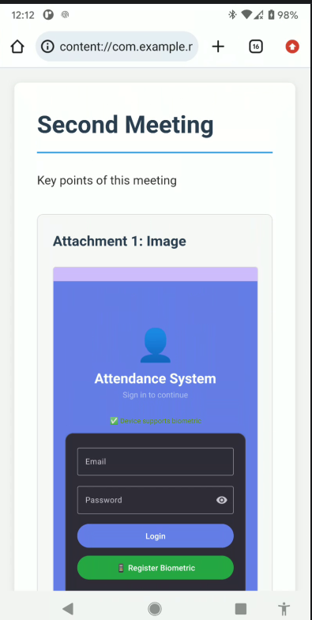

# MultiNote – Multimedia Note-Taking Application

A feature-rich Flutter application for creating, managing, and sharing multimedia notes. The application allows users to write and save notes while attaching images, audio, and video. It also includes text-to-speech functionality for reading written notes aloud and supports exporting notes as HTML files for easy sharing across different platforms.

## Features

### 📝 Create and Save Notes

* Create text-based notes.
* Save and manage written content.
* Access saved notes for future reference.

### 🎙️ Audio Support

* Attach or include audio content in notes.
* Create richer notes by combining written and audio information.

### 🖼️ Image Support

* Add images to notes.
* Store visual information together with written content.

### 🎥 Video Support

* Attach or include video content within notes.
* Support multimedia note-taking for different types of information.

### 🔊 Text-to-Speech

* Read written notes aloud.
* Convert text content into speech to improve accessibility and usability.

### 📄 Export Notes to HTML

* Convert written notes into HTML format.
* Generate portable HTML files that can be opened and viewed in web browsers.

### 📤 Share Notes

Exported notes can be shared through supported applications and services, including:

* WhatsApp
* Email
* Bluetooth
* Other compatible sharing applications

The application uses the device's native sharing capabilities to provide flexible sharing options.


### Home Screen


### 📝 Creating a Note


### Multimedia Note



### Export and Share


## Technology Stack

* **Flutter**
* **Dart**
* Android SDK
* Text-to-Speech integration
* Multimedia handling
* File export functionality
* Native device sharing capabilities

## Application Workflow

```text
Create Note
     │
     ▼
Add Text and Multimedia Content
     │
     ├── Images
     ├── Audio
     └── Video
     │
     ▼
Save Note
     │
     ├── Read Using Text-to-Speech
     │
     └── Export as HTML
             │
             ▼
        Share the File
             │
             ├── WhatsApp
             ├── Email
             ├── Bluetooth
             └── Other Applications
```

## Installation

### Prerequisites

Make sure you have the following installed:

* Flutter SDK
* Android Studio or Visual Studio Code
* An Android emulator or physical Android device

### Clone the Repository

```bash
git clone https://github.com/YOUR-USERNAME/YOUR-REPOSITORY.git
```

Navigate into the project directory:

```bash
cd YOUR-REPOSITORY
```

Install dependencies:

```bash
flutter pub get
```

Run the application:

```bash
flutter run
```

## Project Structure

```text
lib/
├── main.dart
├── models/
├── screens/
├── services/
├── widgets/
└── utils/
```

## Key Technical Skills Demonstrated

This project demonstrates practical experience in:

* Flutter mobile application development
* Dart programming
* Multimedia file handling
* Local data storage
* Text-to-Speech integration
* File generation and HTML export
* Native sharing functionality
* Android application development
* User interface development
* Mobile application architecture

## Future Improvements

Possible future enhancements include:

* Cloud synchronization and backup
* User authentication
* Search and note filtering
* Categories and tags
* Dark mode
* PDF export
* End-to-end encryption
* Rich text formatting
* Voice recording directly inside the application
* Automatic AI-generated note summaries

## Author

**Ezekiel Michael Juma**

BSc in Cyber Security and Digital Forensics Engineering
Cybersecurity | Digital Forensics | Django | Flutter | Java | AI | Web Security | Mobile Security

📧 Email: [ezekielmichaeljuma1st@gmail.com](mailto:ezekielmichaeljuma1st@gmail.com)

## License

This project is intended for educational and portfolio purposes.
